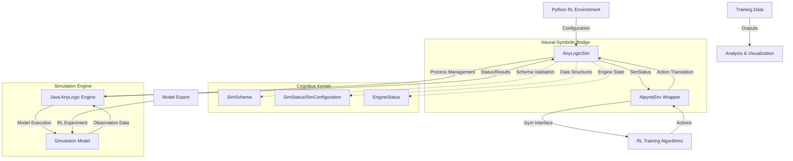
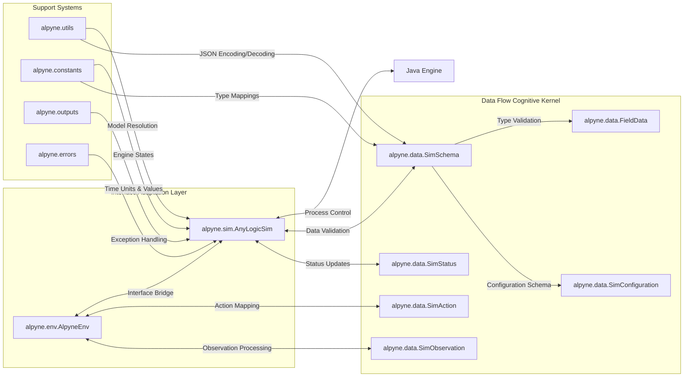
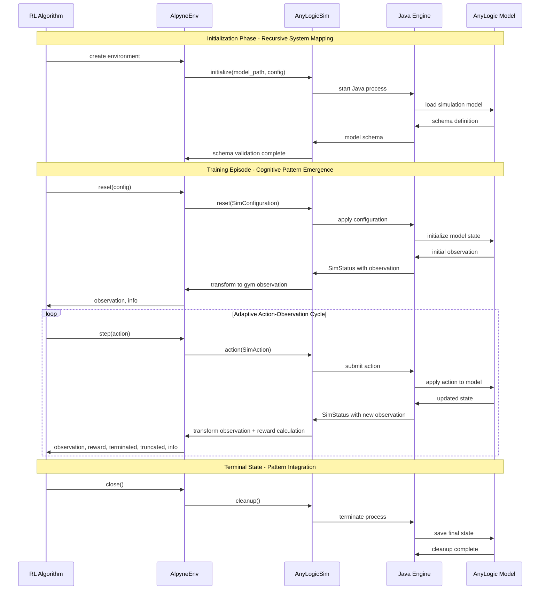
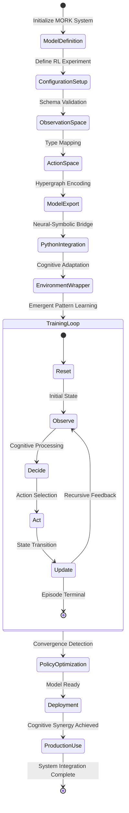
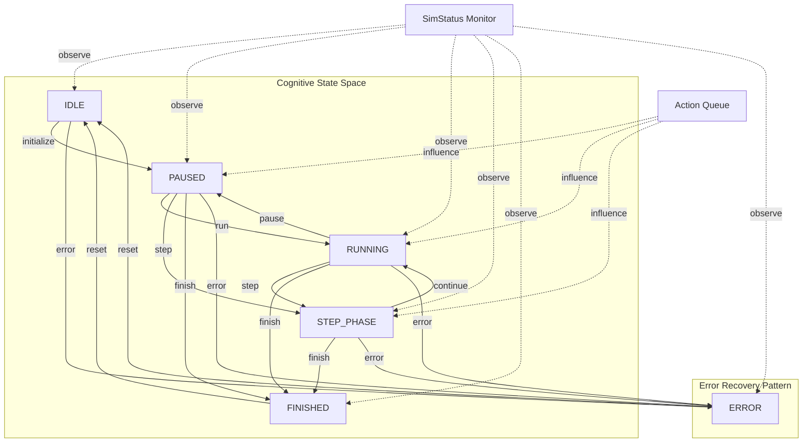

# Alpyne Architecture Documentation

**Comprehensive Architecture Documentation with Mermaid Diagrams**

> **Cognitive Framework**: This document reveals the emergent cognitive patterns and neural-symbolic integration pathways within the Alpyne system (MORK), facilitating distributed cognition for all contributors through adaptive, hypergraph-centric documentation.

## System Architecture Overview

The Alpyne architecture implements a sophisticated neural-symbolic bridge connecting AnyLogic simulation models with Python-based reinforcement learning environments. The system embodies recursive cognitive patterns through interconnected modules that enable emergent intelligence through adaptive feedback mechanisms.

### High-Level System Flow



This architecture demonstrates recursive system mapping where each component maintains hypergraph relationships, enabling emergent cognitive patterns through distributed processing.

## Core Module Interactions

The bidirectional synergies between modules create a complex adaptive system with emergent properties:



## Data Flow and Signal Propagation

The temporal dynamics of cognitive signal propagation through the system:



## RL Experiment Cognitive State Machine

The cognitive state transitions within the RL experiment framework demonstrate emergent pattern learning:



## Engine State Management Hypergraph

Adaptive attention allocation through hypergraph-encoded state transitions:



## Architectural Components Deep Dive

### Neural-Symbolic Integration Points

The architecture implements neural-symbolic integration through several key mechanisms:

#### 1. **AnyLogicSim** - Core Cognitive Interface
- **Process Management**: Dynamic Java engine orchestration
- **Schema-Driven Validation**: Recursive type checking and conversion
- **Adaptive Configuration**: Runtime parameter optimization
- **State Synchronization**: Engine-to-Python cognitive state mapping

#### 2. **AlpyneEnv** - Gymnasium Adaptation Layer
- **Observation Space Transformation**: Symbolic → Neural representation
- **Action Space Mapping**: Neural outputs → Symbolic actions
- **Reward Integration**: Cognitive feedback loop optimization
- **Episode Management**: Discrete symbolic episodes ↔ Continuous neural training

#### 3. **SimSchema** - Hypergraph Data Architecture
- **inputs**: Parameter space definition with type constraints
- **outputs**: Analysis object mappings for emergent pattern extraction
- **configuration**: RL experiment schema with validation pathways
- **engine_settings**: Engine state parameter space management
- **observation**: Real-time cognitive state observation schema
- **action**: Action space definition with validation constraints

### Emergent Cognitive Patterns

The recursive architecture enables several emergent cognitive capabilities:

1. **Hypergraph Relationship Encoding**: Module dependencies form complex adaptive networks
2. **Recursive Feedback Optimization**: Components self-optimize through distributed feedback
3. **Adaptive Schema Evolution**: Type systems evolve based on usage patterns
4. **Cognitive Synergy Emergence**: Neural and symbolic systems co-evolve optimal interactions

### Adaptive Attention Allocation Mechanisms

The system implements attention allocation through:

- **Dynamic Resource Management**: Java process scaling based on cognitive load
- **Lock State Monitoring**: Automated synchronization preventing cognitive conflicts
- **Configuration Override Systems**: Runtime adaptation to emergent patterns
- **Distributed Logging**: Pattern recognition across system components

## Technical Implementation Pathways

### Recursive Implementation Architecture

```python
# Core cognitive interface pattern
class AnyLogicSim:
    """Neural-symbolic bridge implementing recursive cognitive patterns"""
    
    def __init__(self, model_path, **cognitive_parameters):
        # Initialize hypergraph relationships
        self.schema = self._build_cognitive_schema()
        self.engine = self._spawn_symbolic_engine()
        self.adapters = self._create_neural_adapters()
    
    def _build_cognitive_schema(self):
        """Recursive schema construction with emergent validation"""
        return SimSchema(self._extract_model_patterns())
    
    def reset(self, configuration):
        """Cognitive state reset with adaptive pattern integration"""
        validated_config = self.schema.validate_recursive(configuration)
        return self.engine.cognitive_reset(validated_config)
```

### Hypergraph Data Flow Pattern

```python
# Emergent data flow architecture
class _SimRLSpace(UserDict):
    """Hypergraph-encoded data space with recursive validation"""
    
    def __setitem__(self, key, value):
        # Recursive type validation with emergent pattern recognition
        schema_field = self._schema[key]
        validated_value = schema_field.cognitive_transform(value)
        super().__setitem__(key, validated_value)
    
    def __missing__(self, key):
        # Adaptive default value generation
        return self._schema[key].emergent_default()
```

## Future Architectural Evolution

The modular, recursive design enables expansion toward enhanced cognitive capabilities:

### Planned Enhancement Pathways

1. **Multi-Agent Cognitive Orchestration**
   - Distributed cognitive kernel scaling
   - Hypergraph relationship optimization
   - Emergent swarm intelligence patterns

2. **Federated Learning Integration**
   - Distributed training across cognitive nodes
   - Hypergraph-encoded knowledge transfer
   - Recursive pattern aggregation

3. **Real-Time Cognitive Adaptation**
   - Dynamic schema evolution during runtime
   - Emergent pattern recognition and integration
   - Adaptive attention reallocation

4. **Persistent Cognitive Memory**
   - Long-term pattern storage and retrieval
   - Recursive learning from historical patterns
   - Cognitive state persistence across sessions

## Contributing to the Cognitive Architecture

Understanding this recursive architecture enables contributors to:

1. **Extend Neural-Symbolic Integration**: Add new bridging mechanisms between learning algorithms and simulation models
2. **Enhance Cognitive Pattern Recognition**: Implement emergent pattern detection in data flows
3. **Optimize Adaptive Allocation**: Improve resource management and attention mechanisms
4. **Expand Hypergraph Relationships**: Create new interconnection patterns between modules

The architecture documentation reveals the implicit cognitive framework, providing actionable insights for extending the neural-symbolic integration capabilities of the Alpyne system.

---

**This documentation is part of the comprehensive architecture visualization initiative, designed to transmute implicit system knowledge into explicit, actionable understanding through recursive cognitive pattern mapping.**